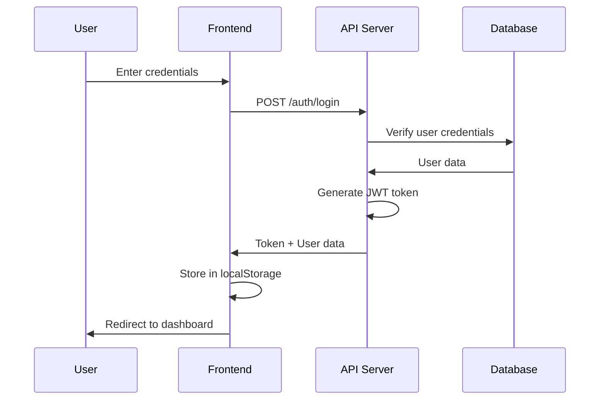

# Frontend Integration Guide

This document explains how to integrate the ChainGuard AI frontend with the backend services, database, and other components.

## Table of Contents

1. [Architecture Overview](#architecture-overview)
2. [API Integration](#api-integration)
3. [Database Integration](#database-integration)
4. [Authentication Flow](#authentication-flow)
5. [Real-time Updates](#real-time-updates)
6. [Error Handling](#error-handling)
7. [Deployment](#deployment)

## Architecture Overview

```
┌─────────────────┐
│   Frontend      │
│   (React/Vite)  │
│   Port: 5173    │
└────────┬────────┘
         │ HTTP/REST
         │ JWT Auth
         ▼
┌─────────────────┐
│   API Server    │
│   (Node.js)     │
│   Port: 3000    │
└────────┬────────┘
         │
         ├──────────┬──────────┬──────────┐
         ▼          ▼          ▼          ▼
    ┌────────┐ ┌────────┐ ┌────────┐ ┌────────┐
    │Postgres│ │  Redis │ │  AI    │ │ Alert │
    │   DB   │ │  Queue │ │ Engine │ │Service│
    └────────┘ └────────┘ └────────┘ └────────┘
```

## API Integration

### Base Configuration

The frontend connects to the API server via Axios. Configuration is in `frontend/src/services/api.js`:

```javascript
const API_BASE_URL = import.meta.env.VITE_API_URL || 'http://localhost:3000'

const api = axios.create({
  baseURL: API_BASE_URL,
  headers: {
    'Content-Type': 'application/json',
  },
})
```

### Environment Variables

Create `frontend/.env`:

```bash
VITE_API_URL=http://localhost:3000
```

For production:

```bash
VITE_API_URL=https://api.chainguard.ai
```

### Authentication Token

JWT tokens are automatically added to requests:

```javascript
api.interceptors.request.use((config) => {
  const token = localStorage.getItem('token')
  if (token) {
    config.headers.Authorization = `Bearer ${token}`
  }
  return config
})
```

### API Endpoints Mapping

| Frontend Method | API Endpoint | Description |
|----------------|--------------|-------------|
| `authAPI.login()` | `POST /auth/login` | User authentication |
| `authAPI.verify()` | `POST /auth/verify` | Token verification |
| `subnetsAPI.getAll()` | `GET /subnets` | List all subnets |
| `subnetsAPI.getById()` | `GET /subnets/:id` | Get subnet details |
| `subnetsAPI.create()` | `POST /subnets` | Create subnet (admin) |
| `subnetsAPI.update()` | `PATCH /subnets/:id` | Update subnet (admin) |
| `subnetsAPI.delete()` | `DELETE /subnets/:id` | Delete subnet (admin) |
| `transactionsAPI.getBySubnet()` | `GET /subnets/:id/transactions` | Get transactions |
| `transactionsAPI.getByHash()` | `GET /transactions/:hash` | Get transaction details |
| `alertsAPI.getBySubnet()` | `GET /subnets/:id/alerts` | Get alerts |
| `alertsAPI.acknowledge()` | `PATCH /alerts/:id/acknowledge` | Acknowledge alert |
| `alertsAPI.markFalsePositive()` | `POST /alerts/:id/false-positive` | Mark false positive |
| `statsAPI.getSubnetStats()` | `GET /subnets/:id/stats` | Get subnet statistics |

## Database Integration

The frontend doesn't directly connect to the database. All database operations go through the API server.

### Data Flow

```
Frontend → API Server → Database
   ↓           ↓           ↓
  Display   Business    Data Storage
           Logic
```

### Example: Loading Subnet Data

1. **Frontend Request**:
```javascript
const response = await subnetsAPI.getAll()
```

2. **API Server** (handles database query):
```javascript
// In api-server/src/routes/subnets.js
const subnets = await db.getSubnets(limit, offset, filters)
```

3. **Database Query** (executed by API server):
```sql
SELECT * FROM subnets 
WHERE is_active = $1 
LIMIT $2 OFFSET $3
```

4. **Response to Frontend**:
```json
{
  "success": true,
  "data": [
    {
      "id": 1,
      "name": "Avalanche C-Chain",
      "chain_id": "43114",
      ...
    }
  ]
}
```

### Real-time Data Updates

For real-time updates, the frontend polls the API:

```javascript
useEffect(() => {
  const interval = setInterval(() => {
    loadDashboardData()
  }, 30000) // Refresh every 30 seconds

  return () => clearInterval(interval)
}, [])
```

**Future Enhancement**: WebSocket integration for true real-time updates.

## Authentication Flow

### Login Process



### Token Management

1. **Storage**: JWT stored in `localStorage`
2. **Validation**: Token verified on app load
3. **Refresh**: Token included in all API requests
4. **Expiration**: 401 response triggers logout

### Protected Routes

```javascript
// PrivateRoute component checks authentication
const PrivateRoute = ({ children }) => {
  const { isAuthenticated, loading } = useAuth()
  
  if (!isAuthenticated) {
    return <Navigate to="/login" />
  }
  
  return children
}
```

## Real-time Updates

### Polling Strategy

Currently implemented via polling:

```javascript
// Dashboard component
useEffect(() => {
  const loadData = async () => {
    await loadDashboardData()
  }
  
  loadData()
  const interval = setInterval(loadData, 30000)
  
  return () => clearInterval(interval)
}, [])
```

### WebSocket Integration (Future)

For true real-time updates, integrate WebSocket:

```javascript
// Connect to WebSocket
const ws = new WebSocket('ws://localhost:3000/ws')

ws.onmessage = (event) => {
  const data = JSON.parse(event.data)
  
  if (data.type === 'new_alert') {
    // Update alerts in real-time
    setAlerts(prev => [data.alert, ...prev])
  }
  
  if (data.type === 'transaction_update') {
    // Update transaction count
    setStats(prev => ({
      ...prev,
      totalTransactions: data.count
    }))
  }
}
```

## Error Handling

### API Error Handling

```javascript
api.interceptors.response.use(
  (response) => response.data,
  (error) => {
    if (error.response?.status === 401) {
      // Unauthorized - logout user
      localStorage.removeItem('token')
      window.location.href = '/login'
    }
    
    return Promise.reject(error.response?.data || error)
  }
)
```

### Component Error Handling

```javascript
try {
  const response = await subnetsAPI.getAll()
  if (response.success) {
    setSubnets(response.data)
  }
} catch (error) {
  toast.error(error.error || 'Failed to load subnets')
  console.error(error)
}
```

### User-Friendly Messages

- Network errors: "Unable to connect to server"
- 404 errors: "Resource not found"
- 500 errors: "Server error. Please try again"
- Validation errors: Show specific field errors

## Deployment

### Development Setup

1. **Start Backend Services**:
```bash
# Start all services with docker-compose
docker-compose up -d

# Or start individually
cd services/api-server && npm start
```

2. **Start Frontend**:
```bash
cd frontend
npm install
npm run dev
```

3. **Access**:
- Frontend: http://localhost:5173
- API: http://localhost:3000

### Production Build

1. **Build Frontend**:
```bash
cd frontend
npm run build
```

2. **Serve Static Files**:

**Option A: Nginx**
```nginx
server {
    listen 80;
    server_name chainguard.ai;
    
    root /var/www/chainguard/dist;
    index index.html;
    
    location / {
        try_files $uri $uri/ /index.html;
    }
    
    location /api {
        proxy_pass http://localhost:3000;
        proxy_set_header Host $host;
        proxy_set_header X-Real-IP $remote_addr;
    }
}
```

**Option B: Docker**
```dockerfile
FROM node:18-alpine AS builder
WORKDIR /app
COPY package*.json ./
RUN npm ci
COPY . .
RUN npm run build

FROM nginx:alpine
COPY --from=builder /app/dist /usr/share/nginx/html
EXPOSE 80
CMD ["nginx", "-g", "daemon off;"]
```

### Environment Configuration

**Development** (`frontend/.env.development`):
```bash
VITE_API_URL=http://localhost:3000
```

**Production** (`frontend/.env.production`):
```bash
VITE_API_URL=https://api.chainguard.ai
```

### CORS Configuration

Ensure API server allows frontend origin:

```javascript
// In api-server/src/index.js
app.use(cors({
  origin: process.env.FRONTEND_URL || 'http://localhost:5173',
  credentials: true
}))
```

## Integration Checklist

- [x] API server running and accessible
- [x] Database configured and migrations run
- [x] Frontend environment variables set
- [x] Authentication flow working
- [x] API endpoints responding correctly
- [x] Error handling implemented
- [x] Loading states displayed
- [x] Toast notifications working
- [x] Protected routes functioning
- [x] Data fetching and display working

## Testing Integration

### Test API Connection

```bash
# Test health endpoint
curl http://localhost:3000/health

# Test authentication
curl -X POST http://localhost:3000/auth/login \
  -H "Content-Type: application/json" \
  -d '{"username":"admin","password":"admin123"}'
```

### Test Frontend

1. Open browser console
2. Check for API errors
3. Verify network requests in DevTools
4. Test authentication flow
5. Verify data loading

## Troubleshooting

### CORS Errors

**Problem**: `Access-Control-Allow-Origin` error

**Solution**: 
- Check API server CORS configuration
- Verify `FRONTEND_URL` environment variable
- Ensure API server allows frontend origin

### Authentication Issues

**Problem**: Token not being sent or invalid

**Solution**:
- Check localStorage for token
- Verify token format in Authorization header
- Check token expiration
- Verify JWT_SECRET matches

### API Connection Failed

**Problem**: Cannot connect to API server

**Solution**:
- Verify API server is running
- Check `VITE_API_URL` in frontend `.env`
- Test API endpoint directly with curl
- Check network connectivity
- Verify firewall settings

### Data Not Loading

**Problem**: API returns data but frontend doesn't display

**Solution**:
- Check browser console for errors
- Verify response format matches expected structure
- Check component state updates
- Verify data mapping in components

## Next Steps

1. **WebSocket Integration**: Add real-time updates via WebSocket
2. **Caching**: Implement client-side caching with React Query
3. **Offline Support**: Add service worker for offline functionality
4. **Performance**: Implement code splitting and lazy loading
5. **Testing**: Add unit and integration tests
6. **Monitoring**: Integrate error tracking (Sentry, etc.)

---

**Last Updated**: January 2025
